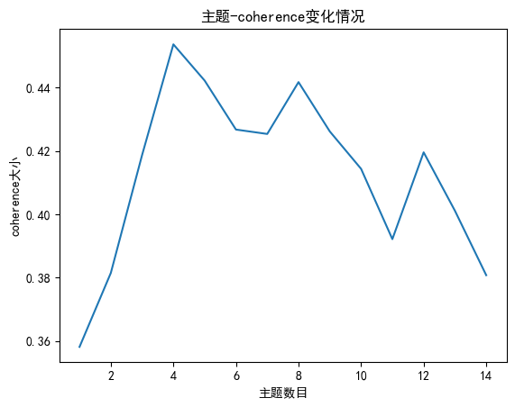

# 2024新闻主题分析-1

## 数据采集
国网福建行业资讯模块 <br>
网址：http://www.fj.sgcc.com.cn/html/main/col12/column_12_1.html<br>
时间范围：2016-09——2024-04<br>
新闻数量：总计1595篇<br>

```
date  count
2016-09	11
2016-10	28
2016-11	13
2016-12	16
2017-01	14
...	...
2023-12	13
2024-01	18
2024-02	8
2024-03	19
2024-04	22
```
新闻excel示例:


## 主题一致性分析

绘制出主题一致性变化折线图如下：

发现主题数量定为7时，主题一致性最大，因此定主题数量为7

## 主题分析


1. Topic 1:
   - Keywords: 工程, 技术, 建设, 发电, 项目, 核电, 国家, 机组, 能源, 记者
2. Topic 2:
   - Keywords: 电力, 市场, 交易, 电价, 改革, 发电, 国家, 项目, 价格, 机制
3. Topic 3:
   - Keywords: 煤炭, 价格, 生产, 供应, 全国, 月份, 天然气, 国家, 煤矿, 能源
4. Topic 4:
   - Keywords: 天然气, 石油, 油气, 全球, 页岩, 原油, 油价, 国际, 产量, 勘探
5. Topic 5:
   - Keywords: 新能源, 汽车, 市场, 电池, 发展, 技术, 政策, 补贴, 电动汽车, 产品
6. Topic 6:
   - Keywords: 用电量, 电网, 用电, 建设, 社会, 电力, 全国, 服务, 能源, 供电
7. Topic 7:
   - Keywords: 能源, 发展, 风电, 发电, 绿色, 建设, 产业, 国家, 项目, 技术
  


主题概率变化热力图


# 东南网新闻主题分析-0528


## 数据采集
东南网今日要闻 <br>
网址：https://fjnews.fjsen.com/fjssyw.htm<br>
时间范围：2024-01——2024-05-27<br>
新闻数量：总计778篇<br>

```
date	count
2024-01	174
2024-02	152
2024-03	175
2024-04	192
2024-05	85
```


## 主题一致性分析

绘制出主题一致性变化折线图如下：

发现主题数量定为4时，主题一致性最大，因此定主题数量为4

## 主题分析


file:///C:/Users/26341/Desktop/%E7%94%B5%E7%BD%91%E9%A1%B9%E7%9B%AE-%E6%96%87%E6%9C%AC%E5%88%86%E6%9E%90/0528_LDA_output/4topic.html#topic=0&lambda=1&term=

**主题 1:**

0.026*"发展", 0.025*"工作", 0.018*"建设", 0.010*"服务", 0.009*"会议", 0.008*"全省", 0.008*"思想", 0.008*"总书记", 0.008*"时代", 0.008*"高质量", 0.007*"精神", 0.007*"教育", 0.007*"生态", 0.007*"改革", 0.006*"全面", 0.005*"合作", 0.005*"融合", 0.005*"政治", 0.005*"现代化", 0.005*"乡村"

**主题 2:**

0.026*"发展", 0.021*"产业", 0.013*"经济", 0.009*"项目", 0.008*"科技", 0.008*"产业链", 0.007*"数据", 0.007*"记者", 0.007*"生产", 0.006*"平台", 0.006*"产品", 0.006*"建设", 0.006*"市场", 0.006*"技术", 0.005*"投资", 0.005*"生产力", 0.005*"材料", 0.005*"新质", 0.005*"服务", 0.005*"转型"

**主题 3:**

0.023*"文化", 0.015*"旅游", 0.014*"活动", 0.011*"文旅", 0.010*"记者", 0.008*"游客", 0.006*"传统", 0.006*"福建日报", 0.005*"乡村", 0.005*"发展", 0.005*"国家", 0.005*"品牌", 0.005*"消费", 0.004*"特色", 0.004*"日讯", 0.004*"主题", 0.004*"世界", 0.003*"体验", 0.003*"进出口", 0.003*"现场"

**主题 4:**

0.010*"农业", 0.009*"记者", 0.007*"全国", 0.006*"工作", 0.006*"福建日报", 0.006*"生产", 0.005*"发展", 0.005*"旅客", 0.005*"技术", 0.005*"食物", 0.005*"项目", 0.005*"品种", 0.005*"建设", 0.004*"台胞", 0.004*"日讯", 0.004*"服务", 0.004*"养殖", 0.004*"全省", 0.004*"生态", 0.004*"资源"

主题概率变化热力图


