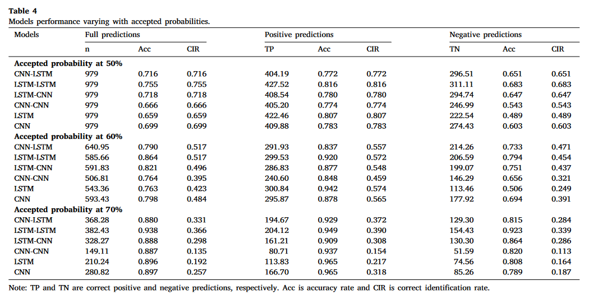

# 学习深度学习基础知识

## 1.看了一些[视频](https://www.bilibili.com/video/BV1K94y1Z7wn/?spm_id_from=333.999.0.0&vd_source=34a5f439de2d2dbd8776ab6af661b559)

从基础了解了深度学习相关知识

<!-- 简单总结：………… -->

[深度学习的一个重大误区，深度学习入门路线推荐](https://www.bilibili.com/video/BV1Ui421k7AU?vd_source=f3f2a7f2995704671529493491b57e91)
## 2.深度学习环境配置

本地跑不了，一般都是英伟达的显卡，我的电脑是amd的，配置好像非常麻烦，效果也不会好

应该要用[学校服务器](https://statserver.readthedocs.io/)来跑

# 看文献

## 1.蜡烛图的混合神经网络模型

[《A parallel hybrid neural networks model for forecasting returns with candlestick technical trading strategy》](https://doi.org/10.1016/j.eswa.2024.124486)

文章介绍：
整体框架：

将价格数据用EMD经验分解为两个基本成分：趋势成分和非趋势成分。

建立了两个子网络，

1.侧重于识别潜在的趋势

2.强调识别短期的动态。

最后将两者纳入了一个全连接层。

通过与基准模型的比较来评估所提出的神经网络模型。通过不同的模型配置进行筛选，确定子网络的最优设置。

数据输入：

将四个价格转化为四个色块图像作为输入

EMD分解：

1. **最初分类**：我们首先将IMF1单独作为一个类别，因为它是最高频率的成分，通常表示最高波动性或噪声部分。

2. **迭代过程**：
   - 将下一个IMF（例如IMF2）添加到包含IMF1的类别中，然后聚合这两个IMF。
   - 对这些聚合后的IMF进行t检验，检验它们的均值是否显著不同于零。

3. **判断标准**：
   - 如果t检验结果显示聚合IMF的均值显著不同于零，这意味着该类别已经开始包含趋势成分。我们停止添加更多的IMF到这个类别。
   - 如果t检验结果显示聚合IMF的均值不显著不同于零，这意味着这个类别仍主要包含噪声成分，我们继续添加下一个IMF。

4. **确定截断点**：
   - 最后一次t检验结果不显著的IMF组合，是确定趋势和非趋势成分的关键。截断点位于最后一次t检验不显著的IMF组合。
   - 之后，所有添加到IMF1类别中的IMF（直到截断点）都被视为非趋势成分，剩下的IMF和残差项则被视为趋势成分。

数据重构：

要预测t+1的价格
非趋势成分：连续四天交易日的四个价格组成非趋势矩阵，即t、t-1、t-2、t-3

趋势成分：从趋势价格中每间隔5个交易日选取一个价格，得到4*4的趋势矩阵，即t、t-5、t-10、t-15

神经网络模型的输入设置为分块矩阵结构

模型验证：

Accepted probability at 50%：表示PHNN模型预测价格涨或跌的概率超过50%即认为产生了交易信号

## 2.[《Attention Is All You Need》](https://arxiv.org/abs/1706.03762)

**这篇论文的一些解读：**
- [中文翻译版](https://blog.csdn.net/nocml/article/details/103082600)

- https://www.bilibili.com/video/BV1pu411o7BE/?spm_id_from=autoNext&vd_source=34a5f439de2d2dbd8776ab6af661b559

- https://www.bilibili.com/video/BV1pr421t73G/?vd_source=34a5f439de2d2dbd8776ab6af661b559

- https://blog.csdn.net/weixin_43427721/article/details/123871234

