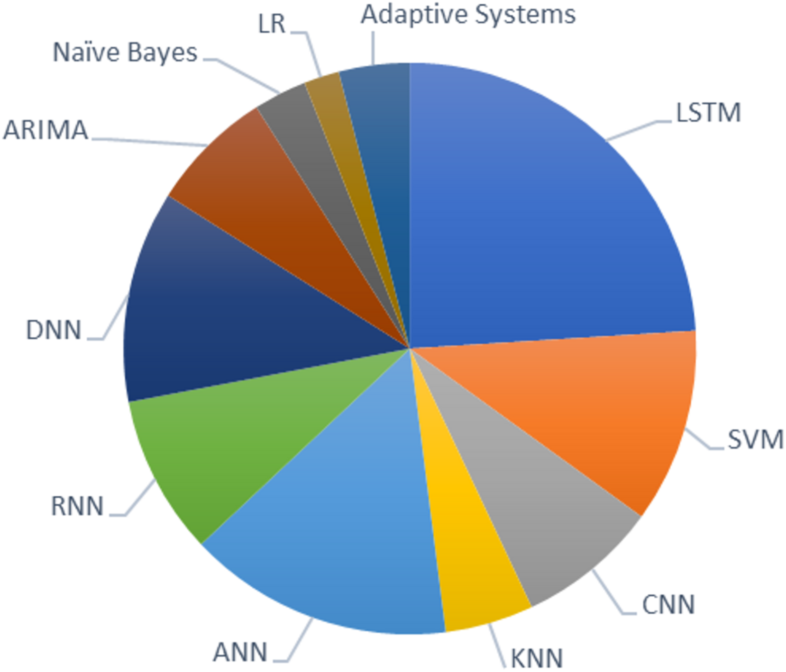
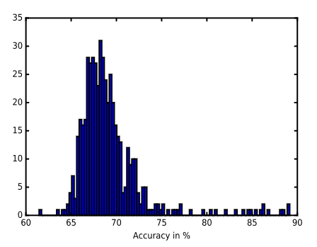
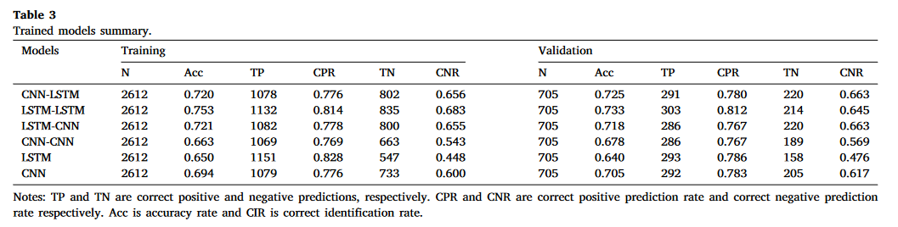
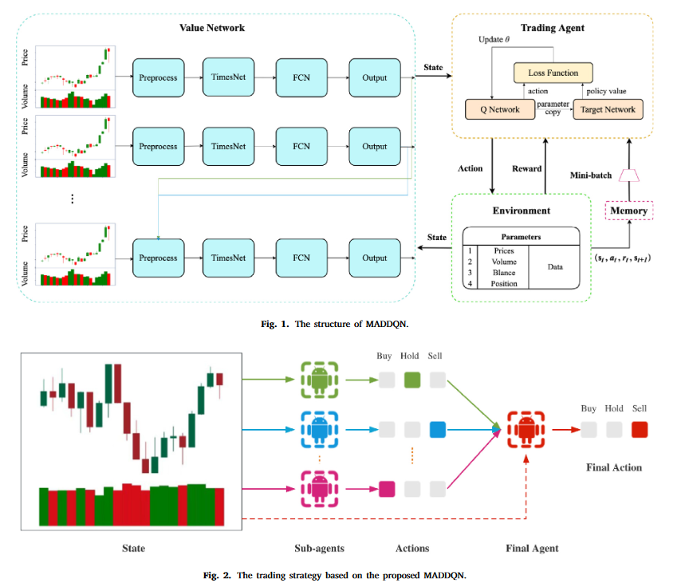
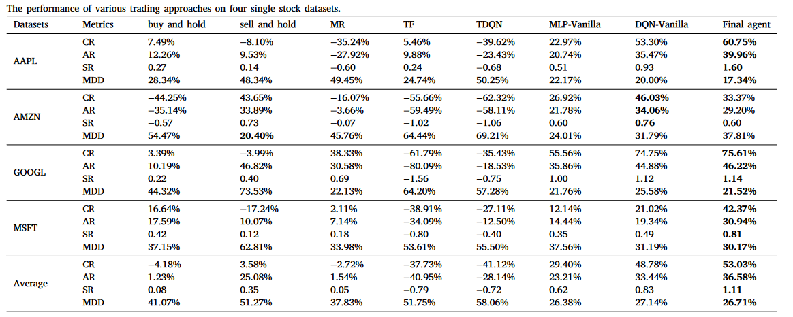

# 课题记录
## 24-0518开题
[开题报告](开题报告.pdf)
主要参考：[《Interpretable image-based deep learning for price trend prediction in ETF markets》](<文献/Zhang 等 - 2023 - Interpretable image-based deep learning for price .pdf>)
上述文章又参考了[(Re‐)Imag(in)ing Price Trends](<文献/Jiang 等 - 2023 - (Re‐)Imag(in)ing Price Trends.pdf>)

整体思路：

1.将股票数据利用波峰波谷、布林带等技术方法拆分成不同长度的数据，然后绘制成图像

2.用图像分类算法进行涨跌预测

问题：

胡杰老师：图像中没有具体的数值数据，那为什么不用图神经网络的方法
## 24-0521

1.能不能加入资金流向等数据

2.变长数据选择可以增加上下限，如5-30天

3.主要看模型效果，北大张瑞勋教授的模型准确率大概在56%

## 24-0619
单个代码：提高准确率很难，市场应该是联动的反应，要么画图，把部分股票的所有图拿进来
而LSTM等时间序列方法，大概只能选一只，

先把相关的模型、算法看一下，花两周时间把文献中的方法整理一下，不一定是图像预测分类，近两年做预测的各种方法，如扩散模型、transformer、attention-LSTM、强化学习，看一下效果，预测准确率、策略收益率等

## 06-24

### 上周进展
所看文献：

#### 1.《StockGPT: A GenAI Model for Stock Prediction and Trading》 ：

自回归"数"模型

StockGPT仅使用到2000年的数据训练一次

获得了119 %的年化收益率，夏普比率为6.5

####  2. 综述文章：2024年
来源期刊：PeerJ Computer Science  不过好像并不是好的期刊，四区

 {width=300px height=200px}

####  3. 综述：2022年 《A comprehensive review on multiple hybrid deep learning approaches for
stock prediction》

CNN - LSTM混合模型在预测股票价格的未来趋势和偏转范围方面非常准确，可用于生成投资组合。混合CNN和LSTM模型在处理更频繁的数据时表现出良好的准确性，因为CNN由于能够捕捉系统中的快速变化而优于LSTM

3.1 《Universal features of price formation in financial markets: perspectives from Deep Learning》

准确率根据股票种类不同而不同，大体上呈现为均值为67%的正态分布

3.2

| Data          | Frequency | Technique   | Output | Performance Measures | References              |
|---------------|-----------|-------------|--------|-----------------------|-------------------------|
| HKEX          | Daily     | LSTM/AttLSTM| Price  | Accuracy              | S. Chen & Ge, 2019      |

####  4. 《A parallel hybrid neural networks model for forecasting returns with candlestick technical trading strategy》

本研究提出了并行混合神经网络模型（PHNN）用于提高蜡烛图技术交易策略预测回报的准确性，使用两个独立子网络（LSTM和CNN）进行价格的分解并进行模型优化，研究结果表明PHNN超越了基准模型，双LSTM被验证为最佳架构选择。

运用图像学习算法
会根据价格分量的不同（高频/低频）选择各自适合的模型进行预测以提高准确率

Metric

<!--  -->

First, except for double CNN architecture, we observe that proposed PHNNs outperform the single LSTM or CNN. As shown in Table 4, when the accepted probability is 50% (accuracy rate equals to correct identification rate), CIRs of PHNN with sub-networks of CNN-LSTM, LSTM-LSTM and LSTM-CNN are above 70%, 0.716, 0.755, and 0.718 respectively, while those of single LSTM and CNN are 0.659 and 0.699 respectively.

无论在哪种情况下，具有LSTM - LSTM子网络的PHNN在所有模型中都贡献了最高的年收益

<!-- 
可预测准确率?

𝐴𝐶𝐶 = 𝑇 𝑃 𝑛𝑢𝑚𝑠 /𝑃 𝑛𝑢𝑚𝑠 (7)  

where 𝑇 𝑃 𝑛𝑢𝑚𝑠 is the number of correct signals and 𝑃 𝑛𝑢𝑚𝑠 is the number of signals generated by the models.

整体预测准确率？
C𝐼𝑅 = 𝑇 𝑃 𝑛𝑢𝑚𝑠 /𝑅𝑒𝑎𝑙𝑛𝑢𝑚𝑠 (8) 

where 𝑇 𝑃 𝑛𝑢𝑚𝑠 is the number of correct signals generated by the models and 𝑅𝑒𝑎𝑙𝑛𝑢𝑚𝑠 is the number of returns. -->

####  5. 《A multi-agent reinforcement learning framework for optimizing financial trading strategies based on TimesNet》

这篇文章好像主要再讲投资框架如何构建能有最大收益而不是预测？

提出了一种新颖的基于MADDQN的金融交易框架，通过创新性地使用两个具有不同交易偏好的代理，成功地平衡了对最大收益的追求和对风险的规避

本文提出的框架开创性地结合了最先进的时间序列模型TimesNet。通过使用该模型，所提出的框架实现了对股票走势的准确预测

该框架由多个独立的智能体组成，每个智能体都使用双层深度Q网络进行训练，以最大化特定的投资偏好。最终代理人从子代理人那里获取Q值，并将它们组合起来做出交易决策。代理人根据个体学习到的偏好共同做出交易决策，以实现整体绩效最优为目标

Metric

累计回报（Cumulative Return，CR）：累计回报是指在一段时间内投资获得的总回报量。它反映了投资在整个持有期间的整体表现，而不考虑期间的时间长度。

年化回报率（Annualized Return，2AR）：年化回报率是指在一段时间内投资的平均年回报率，通常以百分比表示。它将总回报率转换为每年的回报率，以便于不同时间段回报率的比较。

夏普比率（Sharpe Ratio，3SR）：夏普比率用于评估投资或投资组合的风险调整后回报。它衡量的是投资超过无风险利率的超额回报与投资的波动性或总风险之间的比率。夏普比率越高，表示在承担相同风险的情况下，投资的回报越高。

最大回撤（Maximum Drawdown，4MDD）：最大回撤表示投资或投资组合的潜在下行风险，衡量的是在特定时间段内从峰值到谷底的最大百分比跌幅。它用于评估投资可能面临的最大损失。

| Dataset | Metric | Buy and Hold | Sell and Hold | MR | TF | TDQN | MLP-Vanilla | DQN-Vanilla | Final agent |
|---------|--------|--------------|---------------|----|----|------|-------------|-------------|-------------|
| AAPL    | CR     | 7.49%        | −8.10%        | −35.24% | 5.46%  | −39.62% | 22.97%     | 53.30%     | 60.75%     |
|         | AR     | 12.26%       | 9.53%         | −27.92% | 9.88%  | −23.43% | 20.74%     | 35.47%     | 39.96%     |
|         | SR     | 0.27         | 0.14          | −0.60   | 0.24   | −0.68   | 0.51       | 0.93       | 1.60       |
|         | MDD    | 28.34%       | 48.34%        | 49.45%  | 24.74% | 50.25%  | 22.17%     | 20.00%     | 17.34%     |
| AMZN    | CR     | −44.25%      | 43.65%        | −16.07% | −55.66%| −62.32% | 26.92%     | 46.03%     | 33.37%     |
|         | AR     | −35.14%      | 33.89%        | −3.66%  | −59.49%| −58.11% | 21.78%     | 34.06%     | 29.20%     |
|         | SR     | −0.57        | 0.73          | −0.07   | −1.02  | −1.06   | 0.60       | 0.76       | 0.60       |
|         | MDD    | 54.47%       | 20.40%        | 45.76%  | 64.44% | 69.21%  | 24.01%     | 31.79%     | 37.81%     |
| GOOGL   | CR     | 3.39%        | −3.99%        | 38.33%  | −61.79%| −35.43% | 55.56%     | 74.75%     | 75.61%     |
|         | AR     | 10.19%       | 46.82%        | 30.58%  | −80.09%| −18.53% | 35.86%     | 44.88%     | 46.22%     |
|         | SR     | 0.22         | 0.40          | 0.69    | −1.56  | −0.75   | 1.00       | 1.12       | 1.14       |
|         | MDD    | 44.32%       | 73.53%        | 22.13%  | 64.20% | 57.28%  | 21.76%     | 25.58%     | 21.52%     |
| MSFT    | CR     | 16.64%       | −17.24%       | 2.11%   | −38.91%| −27.11% | 12.14%     | 21.02%     | 42.37%     |
|         | AR     | 17.59%       | 10.07%        | 7.14%   | −34.09%| −12.50% | 14.44%     | 19.34%     | 30.94%     |
|         | SR     | 0.42         | 0.12          | 0.18    | −0.80  | −0.40   | 0.35       | 0.49       | 0.81       |
|         | MDD    | 37.15%       | 62.81%        | 33.98%  | 53.61% | 55.50%  | 37.56%     | 31.19%     | 30.17%     |
| Average | CR     | −4.18%       | 3.58%         | −2.72%  | −37.73%| −41.12% | 29.40%     | 48.78%     | 53.03%     |
|         | AR     | 1.23%        | 25.08%        | 1.54%   | −40.95%| −28.14% | 23.21%     | 33.44%     | 36.58%     |
|         | SR     | 0.08         | 0.35          | 0.05    | −0.79  | −0.72   | 0.62       | 0.83       | 1.11       |
|         | MDD    | 41.07%       | 51.27%        | 37.83%  | 51.75% | 58.06%  | 26.38%     | 27.14%     | 26.71%     |

####  6. 《Attention based adaptive spatial–temporal hypergraph convolutional networks for stock price trend prediction》

# 课题进展

## K线数据拆分

## 图像分类预测

先按定长时间图像进行预测？

学习一下图像分类的算法实践

## (Re‐)Imag(in)ing Price Trends代码参考
找到了复现文章《(Re‐)Imag(in)ing Price Trends》的Github
https://github.com/RichardS0268/CNN-for-Trading

https://github.com/lich99/Stock_CNN?tab=readme-ov-file

