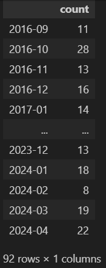
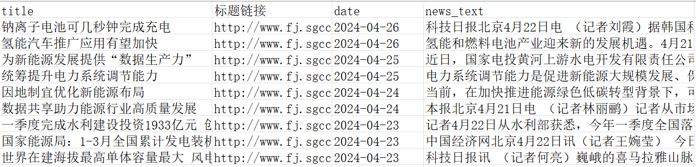
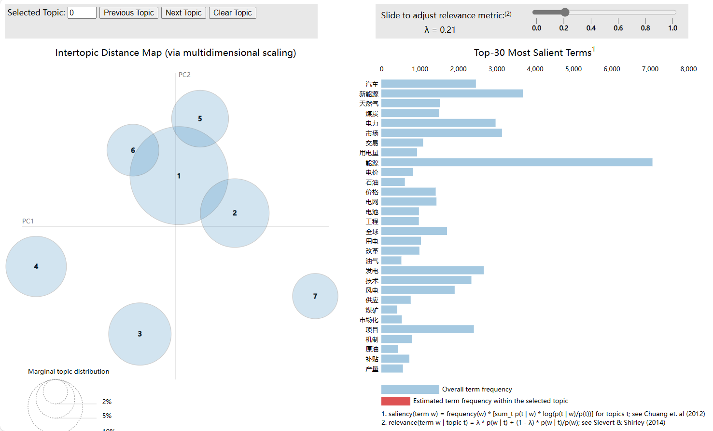

# 2024新闻主题分析

<<<<<<< HEAD
<!-- 参考文档：https://zhuanlan.zhihu.com/p/662387504 -->
=======
>>>>>>> f9eedddb8866c3e3f920fc2f85263f454fec7cc3
## 数据采集
国网福建行业资讯模块 <br>
网址：http://www.fj.sgcc.com.cn/html/main/col12/column_12_1.html<br>
时间范围：2016-09——2024-04<br>
新闻数量：总计1595篇<br>

<<<<<<< HEAD
<!--  -->
=======
>>>>>>> f9eedddb8866c3e3f920fc2f85263f454fec7cc3
```
date  count
2016-09	11
2016-10	28
2016-11	13
2016-12	16
2017-01	14
...	...
2023-12	13
2024-01	18
2024-02	8
2024-03	19
2024-04	22
```
新闻excel示例:


## 主题一致性分析

绘制出主题一致性变化折线图如下：

发现主题数量定为7时，主题一致性最大，因此定主题数量为7

## 主题分析


1. Topic 1:
   - Keywords: 工程, 技术, 建设, 发电, 项目, 核电, 国家, 机组, 能源, 记者
2. Topic 2:
   - Keywords: 电力, 市场, 交易, 电价, 改革, 发电, 国家, 项目, 价格, 机制
3. Topic 3:
   - Keywords: 煤炭, 价格, 生产, 供应, 全国, 月份, 天然气, 国家, 煤矿, 能源
4. Topic 4:
   - Keywords: 天然气, 石油, 油气, 全球, 页岩, 原油, 油价, 国际, 产量, 勘探
5. Topic 5:
   - Keywords: 新能源, 汽车, 市场, 电池, 发展, 技术, 政策, 补贴, 电动汽车, 产品
6. Topic 6:
   - Keywords: 用电量, 电网, 用电, 建设, 社会, 电力, 全国, 服务, 能源, 供电
7. Topic 7:
   - Keywords: 能源, 发展, 风电, 发电, 绿色, 建设, 产业, 国家, 项目, 技术
  


主题概率变化热力图
<<<<<<< HEAD

=======

>>>>>>> f9eedddb8866c3e3f920fc2f85263f454fec7cc3
