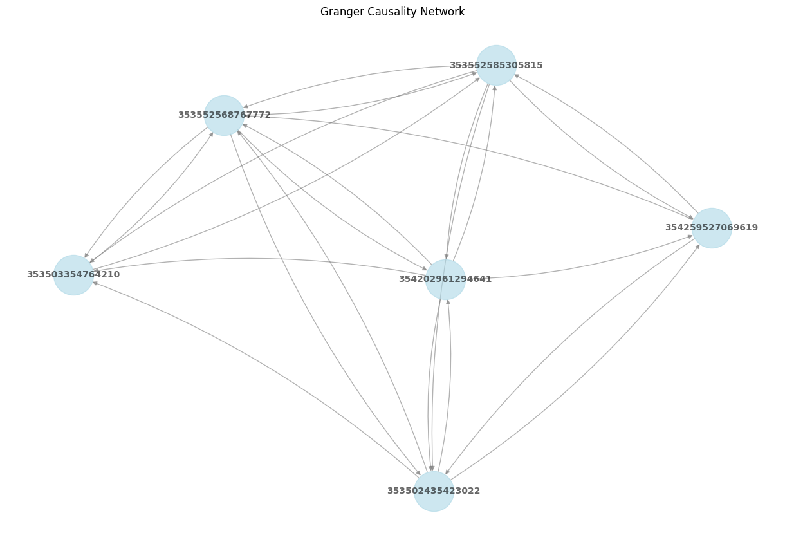

## 因果有向图

sector3 = '28.仪器仪表制造业'
有缺失数据做不了因果，单纯去掉缺失值后，月份数少了很多

| ID       | 353502435423022 | 353503354764210 | 353552568767772 | 353552585305815 |
|:--------:|:---------------:|:---------------:|:---------------:|:----------------:|
| m202203  | 698200.0        | 604317.0        | 1194928.0       | 461970.0         |
| m202204  | 685500.0        | 702097.0        | 1113551.0       | 474480.0         |
| m202205  | 715150.0        | 339588.0        | 1015524.0       | 509460.0         |
| m202206  | 783076.0        | 608381.0        | 1095530.0       | 542190.0         |
| m202207  | 878271.0        | 1139789.0       | 1229680.0       | 571770.0         |
| m202208  | 895064.0        | 1229035.0       | 1315162.0       | 560040.0         |
| m202209  | 754942.0        | 1053714.0       | 1108125.0       | 495720.0         |
| m202210  | 610091.0        | 1041928.0       | 877442.0        | 460590.0         |
| m202211  | 686658.0        | 946099.0        | 1133913.0       | 418470.0         |
| m202212  | 654969.0        | 794593.0        | 1117840.0       | 437340.0         |
| m202301  | 472556.0        | 290982.0        | 585840.0        | 229860.0         |
| m202302  | 578832.0        | 580664.0        | 896252.0        | 397500.0         |
| m202303  | 677261.0        | 703722.0        | 1046891.0       | 525810.0         |
| m202304  | 663721.0        | 764438.0        | 1059365.0       | 565919.0         |
| m202305  | 710161.0        | 860024.0        | 1154282.0       | 570810.0         |
| m202306  | 807584.0        | 1031118.0       | 1251733.0       | 635400.0         |
| m202307  | 839129.0        | 1227816.0       | 1267891.0       | 692850.0         |
| m202308  | 881810.0        | 1193841.0       | 1329095.0       | 735720.0         |
| m202403  | 665647.0        | 680639.0        | 1107844.0       | 522772.0         |

