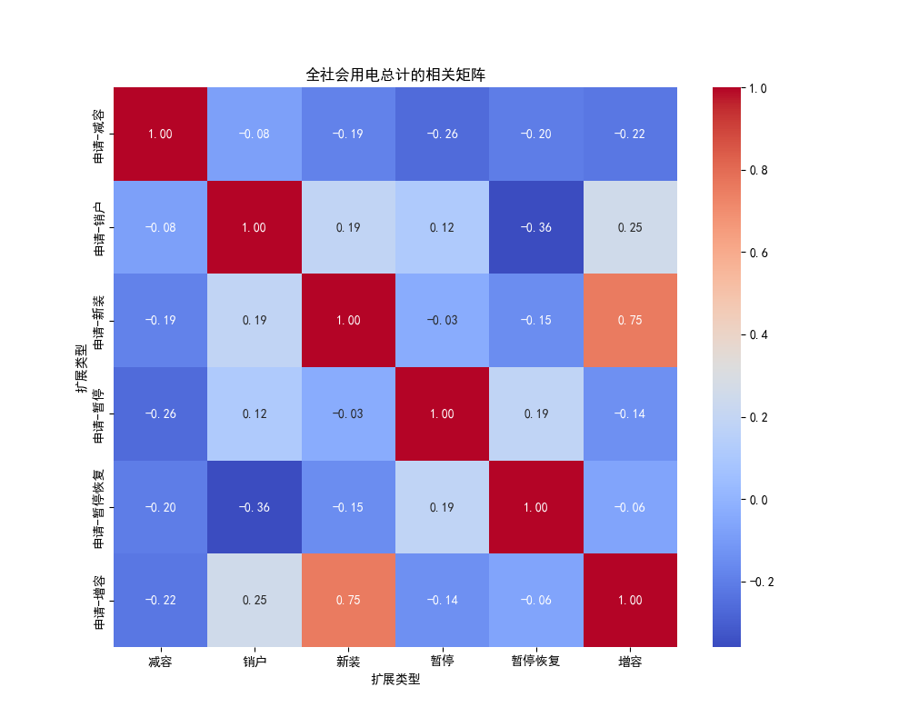
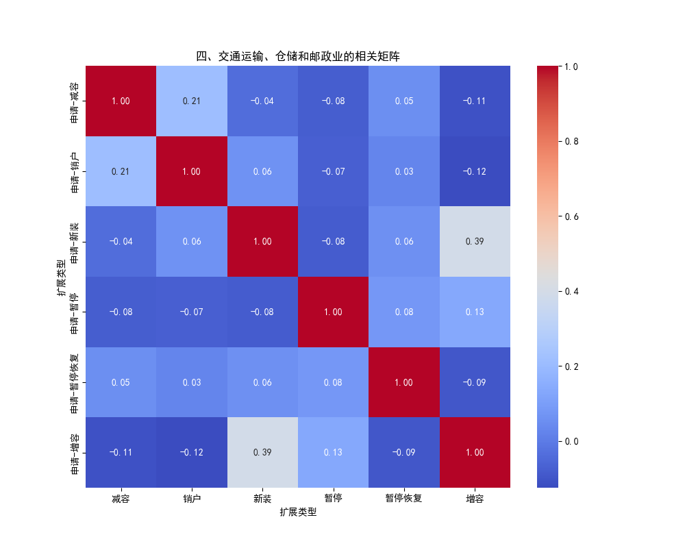
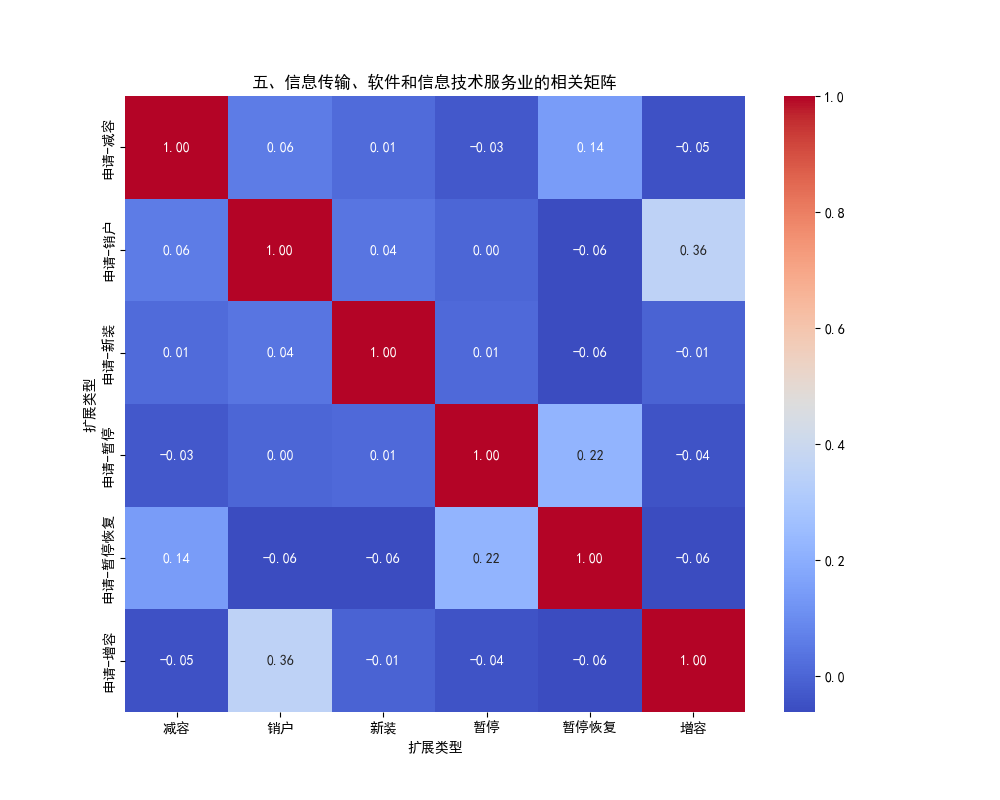
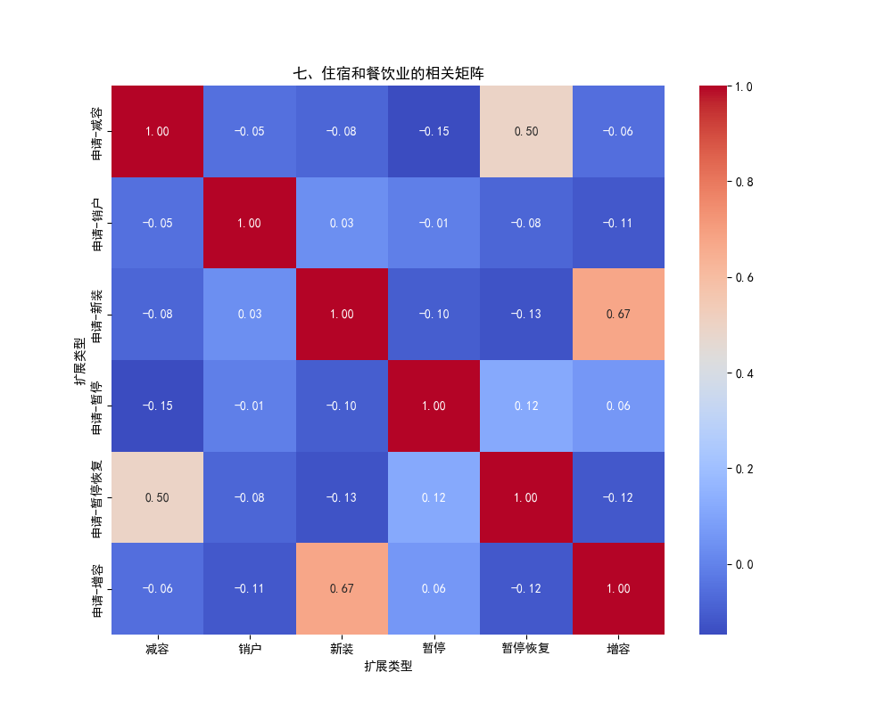
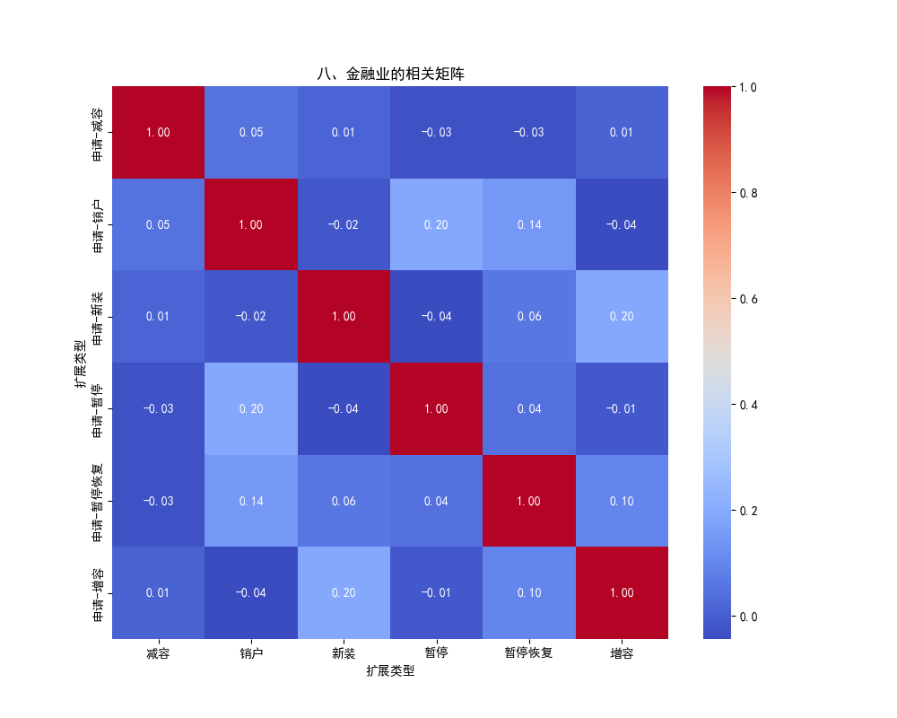
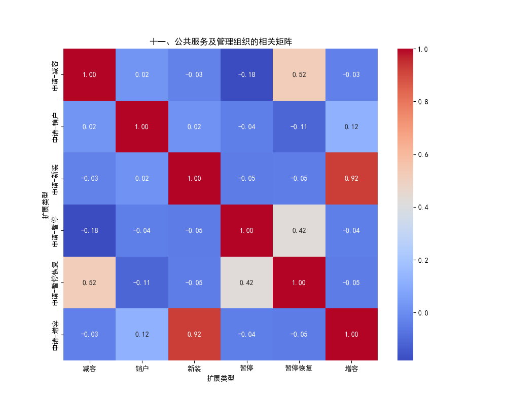

# 0618

## 相关性热力图
以下是各一级行业的相关热力图：

新装和增容强正相关

新装和增容强正相关，减容和暂停恢复有一定正相关

新装和增容强正相关

暂停恢复和暂停正相关

新装和增容正相关0.39

增容和销户正相关0.36

新装和增容强正相关0.79

新装和增容强正相关0.67，减容和暂停恢复正相关0.5

几乎都没有相关性

暂停和暂停恢复正相关0.33

新装和增容正相关0.46

新装和增容强正相关0.92

暂停恢复和减容正相关0.52

暂停恢复和暂停正相关0.42
## 相似度

### 余弦相似度
由于相关系数矩阵是一个矩阵，因此在计算余弦相似度前会将矩阵展平成一维向量

好像余弦相似度并不太能区分出各个行业的不同

余弦相似度只考虑方向不考虑大小，感觉不太适用
 

### 欧氏距离
 

### Pearson相关系数

## 企业相关问题

要将企业与其对应行业作比较，得出企业与行业的一致性和特异性

但是计算相关系数要求各种业扩类型的数据长度一致，但是对于企业来说，时间是缺失的，不同业扩类型数据量不同，无法计算

两步法建立有向图的算法，因果网络的建立
先做个简单筛选，如相关性，找个阈值，

