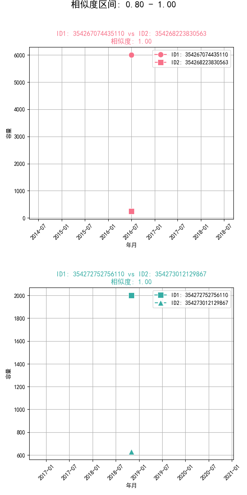
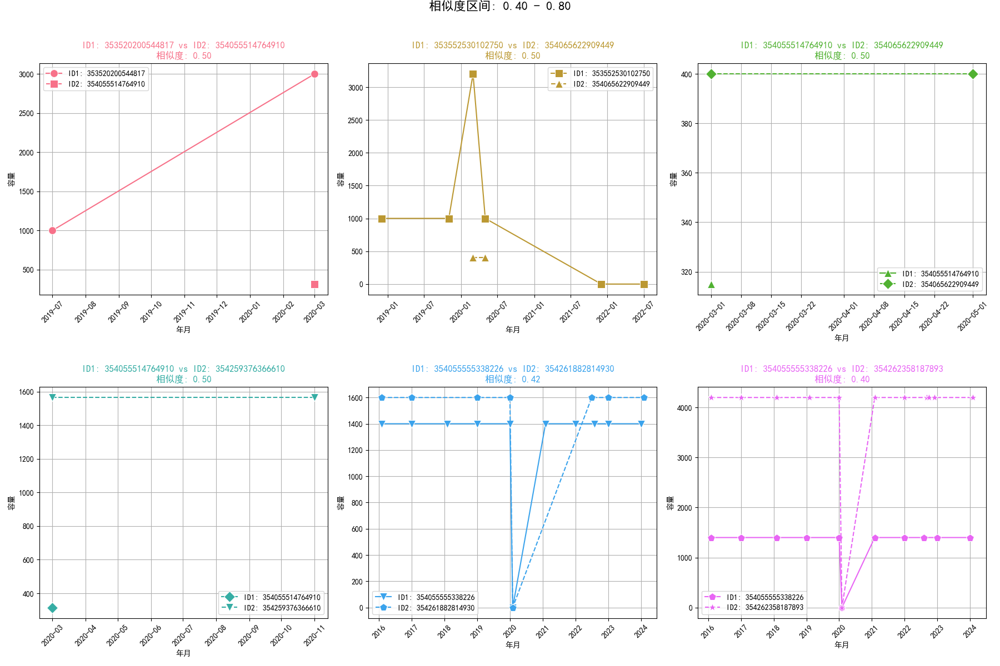

# 0709

将容量转换为二进制向量，用Jaccard距离来计算相似度，得到12种业扩类型下企业之间的相关关系。详细介绍可以参考 [Jaccard距离介绍](https://zhizhou-1.github.io/docs/#/Jaccard%E8%B7%9D%E7%A6%BB%E4%BB%8B%E7%BB%8D/Jaccard%E8%B7%9D%E7%A6%BB%E4%BB%8B%E7%BB%8D)。


```python
# 将容量转换为二进制向量
specific_industry_df['容量二进制'] = specific_industry_df['容量'].apply(lambda x: [1 if i > 0 else 0 for i in x])
```

## 1. 相关性大于0.8的各类型企业的业扩数据时序图

以二、工业  （二）制造业 中的23.专用设备制造业 为例，计算出了各企业之间的Jaccard相似度，然后取出各组相关性大于0.8的各类型企业的业扩数据时序图绘制如下：


 

 

 

 

 

 


## 2. 相关性大于0.4小于0.8的各类型企业的业扩数据时序图


以二、工业  （二）制造业 中的23.专用设备制造业 为例，计算出了各企业之间的Jaccard相似度，然后取出各组相关性大于0.4小于0.8的各类型企业的业扩数据时序图绘制如下：


 

 

 

 

 


## 3. 相关性小于0.4的各类型企业的业扩数据时序图


以二、工业  （二）制造业 中的23.专用设备制造业 为例，计算出了各企业之间的Jaccard相似度，然后取出各组相关性小于0.4的各类型企业的业扩数据时序图绘制如下：


 

 

 

 

 


# 用电相关性


## 23.专用设备制造业


| 统计量 | 值           |
|:------:|:------------:|
| count  | 51.000000     |
| mean   | 2.000000      |
| std    | 2.630589      |
| min    | 0.000000      |
| 25%    | 0.000000      |
| 50%    | 1.000000      |
| 75%    | 3.000000      |
| max    | 10.000000     |


 


## 数据缺失处理


```python

# 示例使用
# 假设df是你的数据框，correlation_columns是要检查的列名列表，ID是表示每一行的ID列名
# row_threshold是行缺失值比例的阈值，如0.5表示50%
# col_threshold是列缺失值比例的阈值，如0.5表示50%
df_002,correlation_columns = filter_missing_values(df_001, correlation_columns, 'ID', 0.2, 0)
print(df_002.shape)
# 检查缺失值情况
df_002.isnull().sum().sum()


```

```
删除的行数: 9
删除的列数: 20
删除后的 correlation_columns: ['M201709', 'M201710', 'M201711', 'M201712', 'M201801', 'M201802', 'M201803', 'M201804', 'M201805', 'M201806', 'M201807', 'M201808', 'M201809', 'M201810', 'M201811', 'M201812', 'M201901', 'M201902', 'M201903', 'M201904', 'M201905', 'M201906', 'M201907', 'M201908', 'M201909', 'M201910', 'M201911', 'M201912', 'M202001', 'M202002', 'M202003', 'M202004', 'M202005', 'M202006', 'M202007', 'M202008', 'M202009', 'M202010', 'M202011', 'M202012', 'm202101', 'm202102', 'm202103', 'm202104', 'm202105', 'm202106', 'm202107', 'm202108', 'm202109', 'm202110', 'm202111', 'm202112', 'm202201', 'm202202', 'm202203', 'm202204', 'm202205', 'm202206', 'm202207', 'm202208', 'm202209', 'm202210', 'm202211', 'm202212', 'm202301', 'm202302', 'm202303', 'm202304', 'm202305', 'm202306', 'm202307', 'm202308', 'm202309', 'm202310', 'm202311', 'm202312', 'm202401', 'm202402', 'm202403', 'm202404']
(42, 81)

```


 


 


 

