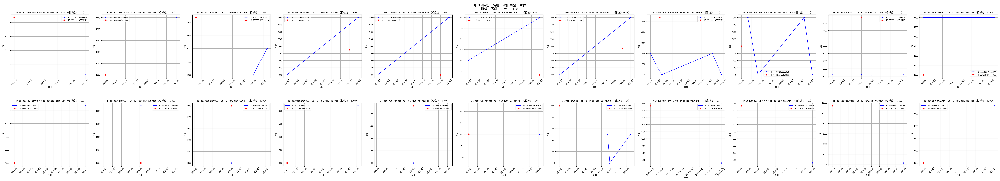

# 上周问题

## 业扩相关性
- jaccard距离计算：没有出错，详见[Jaccard距离介绍](https://zhizhou-1.github.io/docs/#/Jaccard%E8%B7%9D%E7%A6%BB%E4%BB%8B%E7%BB%8D/Jaccard%E8%B7%9D%E7%A6%BB%E4%BB%8B%E7%BB%8D)，当0的数量太多的时候

若改成计算0的数量的话，会使相似度非常集中，相似度均值都达到90%

```python

intersection = sum(1 for x, y in zip(list1, list2) if x == y )
union = len(list1) + len(list2) - intersection
# 计算 Jaccard 相似度
jaccard_similarity = intersection / union
return jaccard_similarity

```

```python
similarities_df['相似度'].describe()
```

```
count    7007.000000
mean        0.904786
std         0.090699
min         0.515152
25%         0.869159
50%         0.941748
75%         0.980198
max         1.000000
Name: 相似度, dtype: float64
```


- 换了一种距离算法SBD（Shape-based Distance），同时改用数值而非1、0


```
count    2256.000000
mean        0.540931
std         0.224042
min         0.020000
25%         0.380000
50%         0.480000
75%         0.700000
max         1.000000
Name: 相似度, dtype: float64
```

**22.专用设备制造业_增容_Threshold_0.8**


**22.专用设备制造业_暂停_Threshold_0.8**


**22.专用设备制造业_暂停恢复_Threshold_0.8**


**22.专用设备制造业_减容_Threshold_0.8**


**22.专用设备制造业_新装_Threshold_0.8**


**阈值0.95-1**

**接电_减容**


**接电_新装**


**接电_暂停**



**接电_暂停恢复**


**接电_增容**


**申请_减容**


**申请_暂停**


**申请_暂停恢复**


**申请_增容**


**阈值0-0.2**

**接电_暂停**


**接电_暂停恢复**


**申请_暂停**


**申请_暂停恢复**


**申请_增容**


## 用电相关性

**STL分解**

**STL Decomposition ID 353502253544949 in 23.专用设备制造业**


**STL Decomposition ID 353503365202156 in 23.专用设备制造业**


**STL Decomposition ID 353520200544817 in 23.专用设备制造业**


**Graph of Row Correlations for 23.专用设备制造业**


**度四分位划分企业的用电数据**


**度top10和孤立点企业的用电数据**


**均值用电量时序图**


