# 相关性分析

## 报装业务结构关系矩阵构建

### 整体关系分析：

行业层面上，对6种业扩业务数据两两之间做相关性分析，得到每个行业下的6*6的相关性热图，表示该行业下各个业扩数据两两之间的相关性关系；

申请比接电重要

全社会用电总计

数据范围：2016-01——2024-04
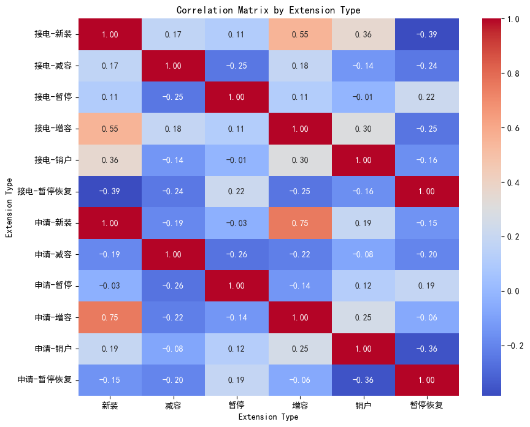

企业层面上，同样得到6*6的相关性热图，然后将企业与其对应行业作比较，得出企业与行业的一致性和特异性。

企业的业扩数据好像暂未整理

A1：标黄表示三四月份新增企业，有从16年开始的业扩数据，但是没有日度用电量数据，只有月度用电量数据

A2：申请时间：申请；归档时间：接电

Q1：企业数据的业扩类型有9个，这些与行业之间如何对应起来

依次为：新装，增容，新装，暂停，暂停恢复，销户，减容，暂停，暂停恢复

Q2:具体用哪个容量

只用申请运行容量即可，申请和接电的容量相同

#### 企业与行业比较方法

可以理解成是矩阵的相似度计算、或者图像的相关性分析

欧几里德距离：适用于数值型数据，可以衡量数据之间的绝对距离。常用于聚类算法中，如K均值聚类。

余弦相似度：适用于文本数据、向量数据等，可以衡量数据之间的方向相似度而不受数据大小的影响。常用于文本挖掘、推荐系统等领域。

相关系数：适用于衡量两个变量之间的线性相关性，可以用于分析变量之间的关联程度。常用于统计分析和数据挖掘中。

Jaccard相似系数：适用于集合数据，可以衡量两个集合之间的相似度。常用于文档相似度计算、推荐系统等。

曼哈顿距离：适用于衡量两个向量之间的绝对距离，常用于图像处理、模式识别等领域。

相似度定义完之后，如何评价同一相似度下不同企业的区别呢

### 2.  滑动窗口关系分析：
行业层面上，选定滑动窗口大小，对6种业扩业务数据建模，得到6*6随时间变化的相关性矩阵；
企业层面上，同样得到6*6随时间变化的相关性矩阵，然后作比较，得出企业与行业在不同时间段内的一致性和特异性。

# 0618

## 相关性热力图
以下是各一级行业的相关热力图：

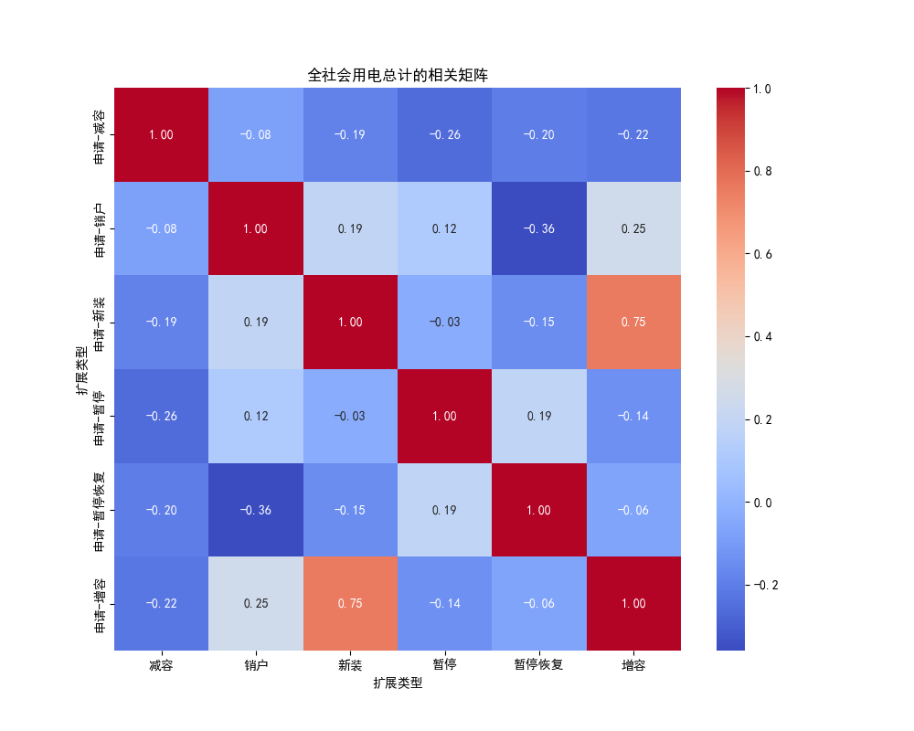
新装和增容强正相关
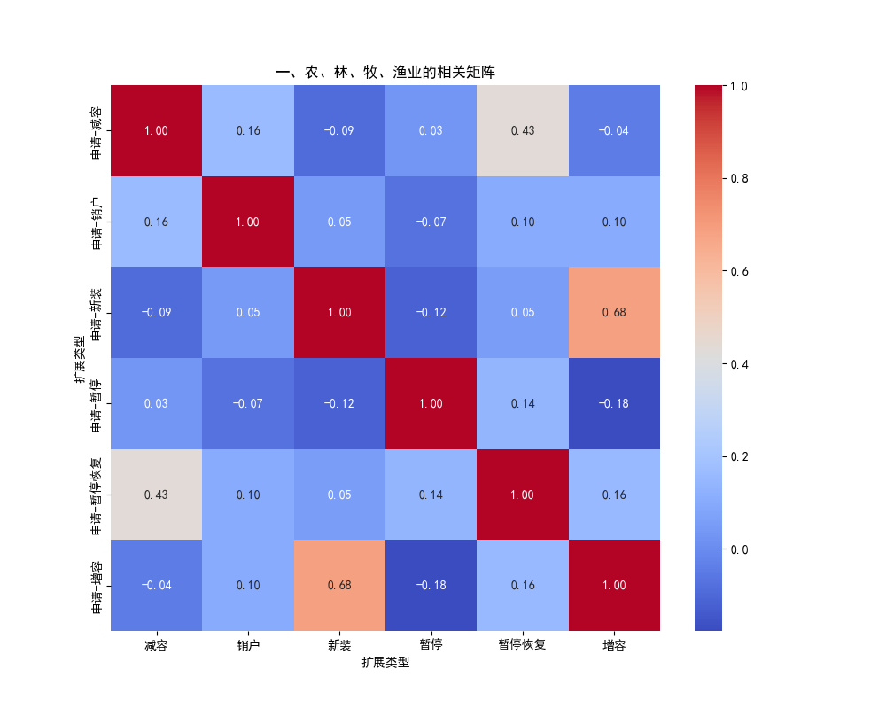
新装和增容强正相关，减容和暂停恢复有一定正相关
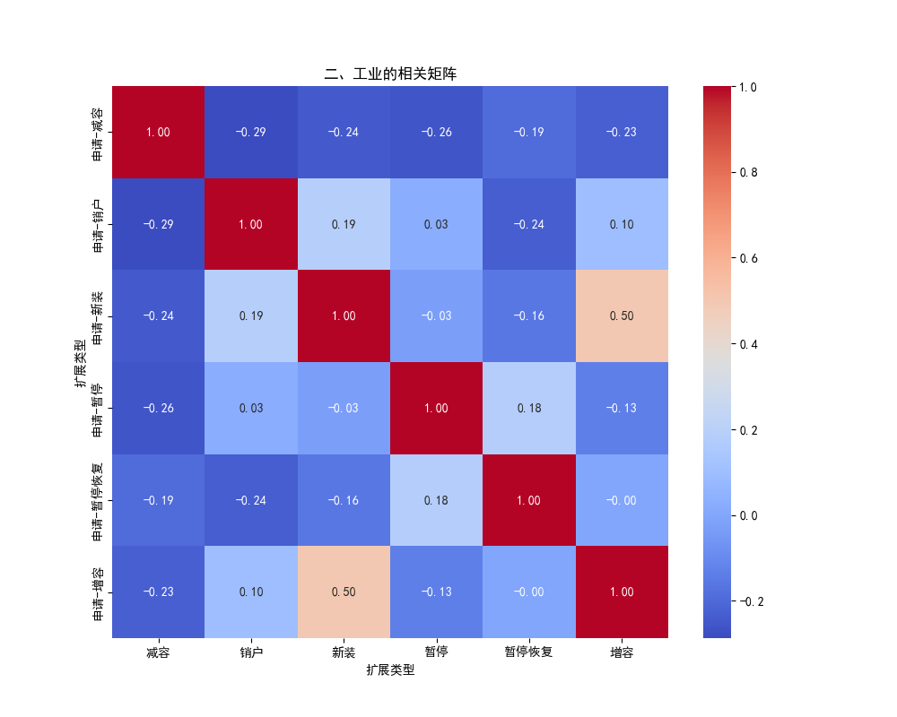
新装和增容强正相关
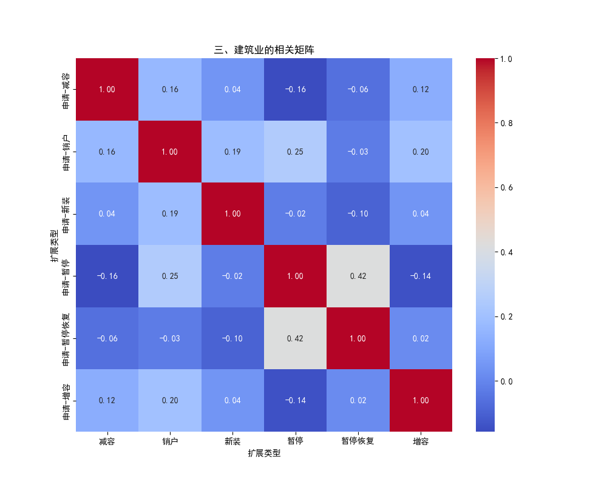
暂停恢复和暂停正相关
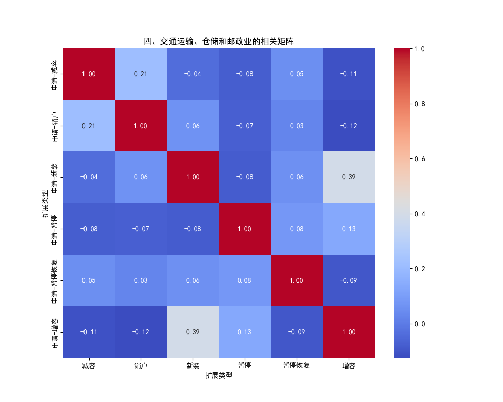
新装和增容正相关0.39
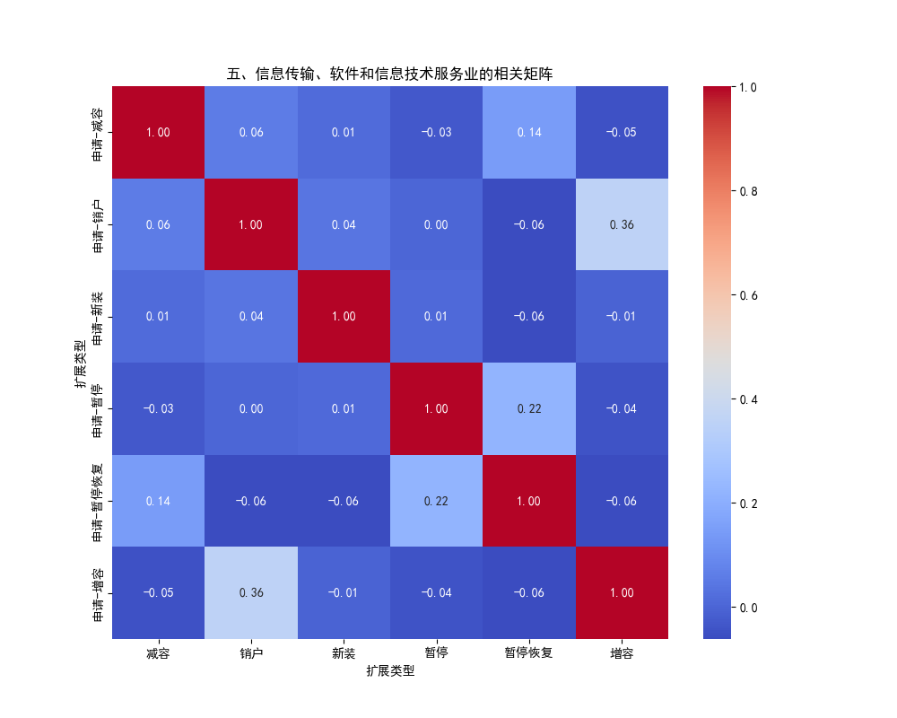
增容和销户正相关0.36
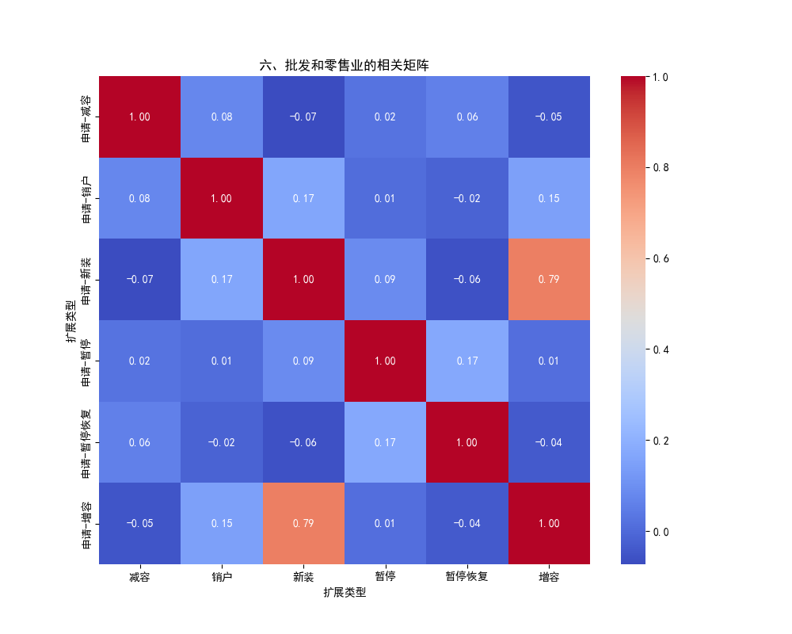
新装和增容强正相关0.79
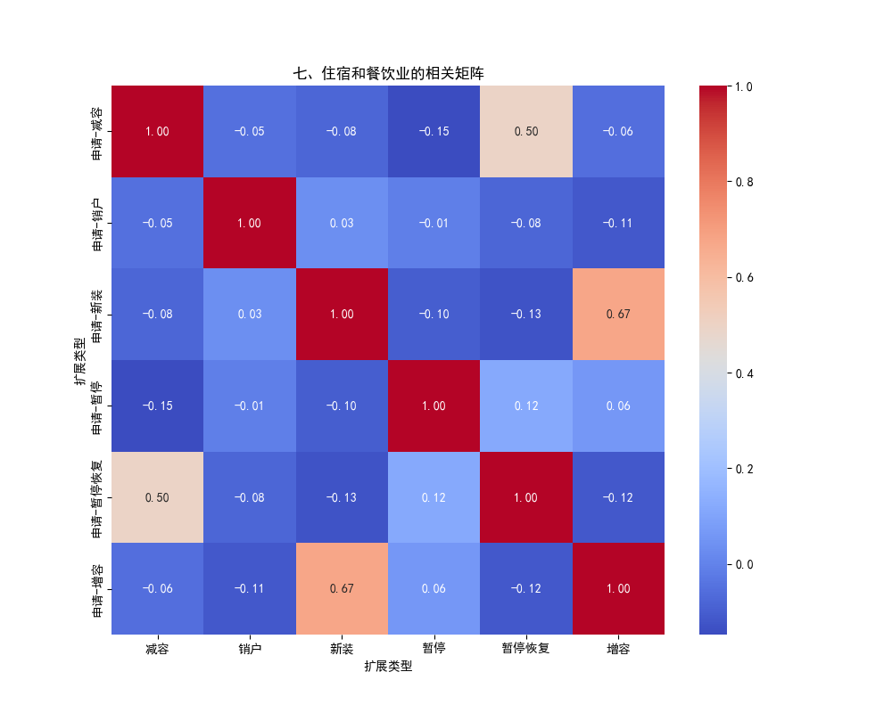
新装和增容强正相关0.67，减容和暂停恢复正相关0.5
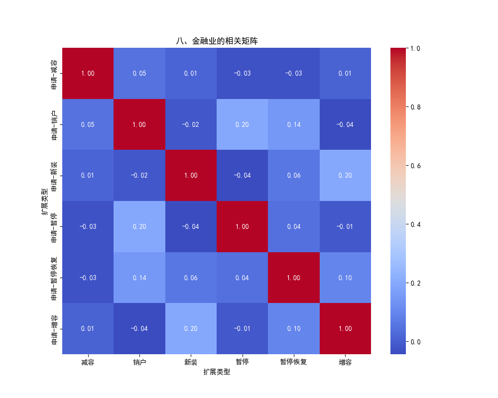
几乎都没有相关性
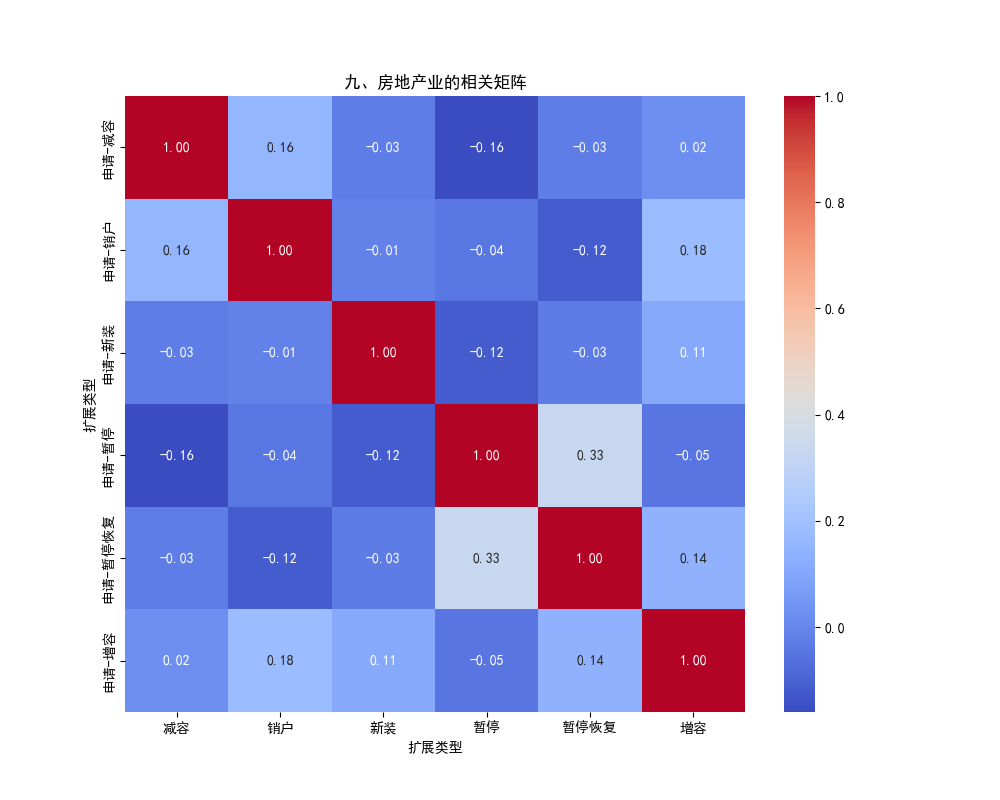
暂停和暂停恢复正相关0.33
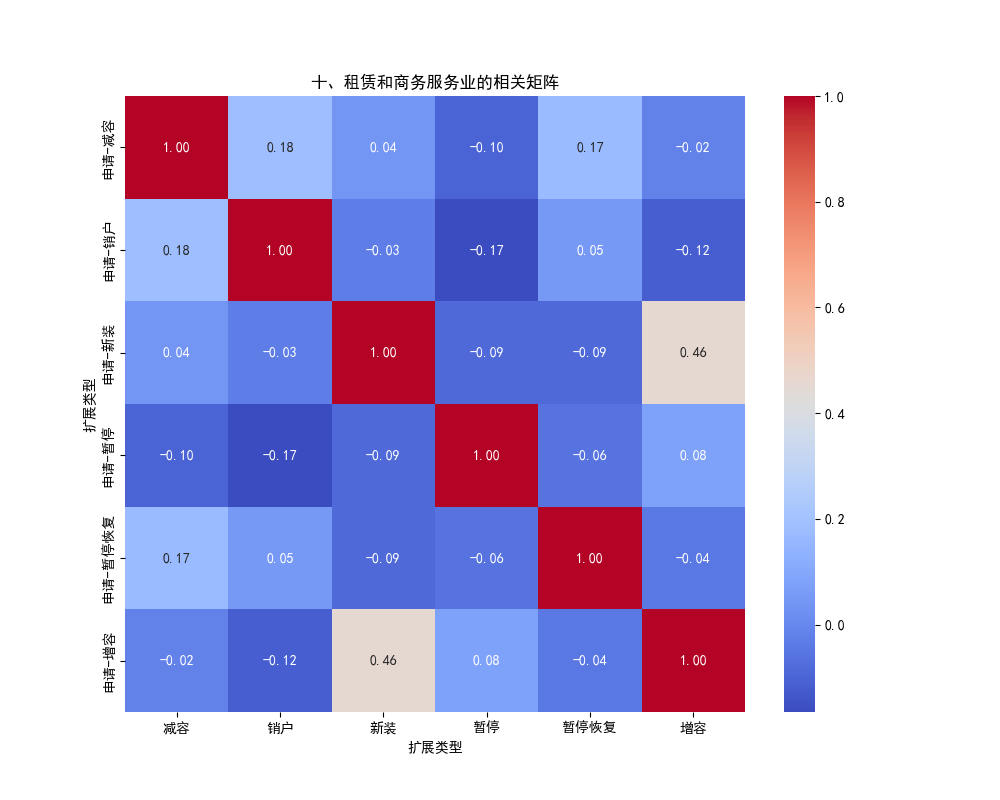
新装和增容正相关0.46
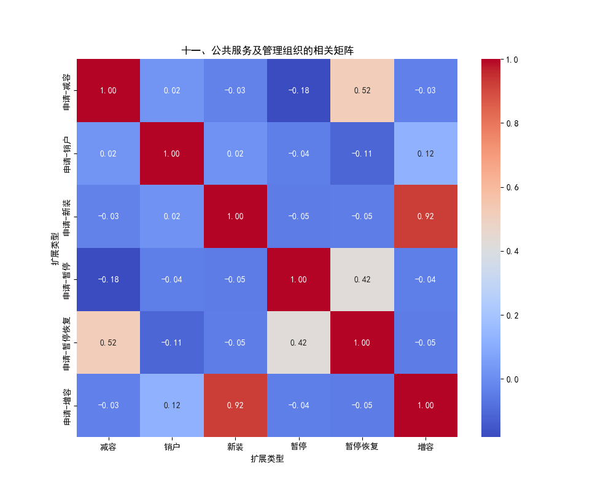
新装和增容强正相关0.92

暂停恢复和减容正相关0.52

暂停恢复和暂停正相关0.42
## 相似度

### 余弦相似度
由于相关系数矩阵是一个矩阵，因此在计算余弦相似度前会将矩阵展平成一维向量

好像余弦相似度并不太能区分出各个行业的不同

余弦相似度只考虑方向不考虑大小，感觉不太适用
 

### 欧氏距离
 

### Pearson相关系数

## 企业相关问题

要将企业与其对应行业作比较，得出企业与行业的一致性和特异性

但是计算相关系数要求各种业扩类型的数据长度一致，但是对于企业来说，时间是缺失的，不同业扩类型数据量不同，无法计算

