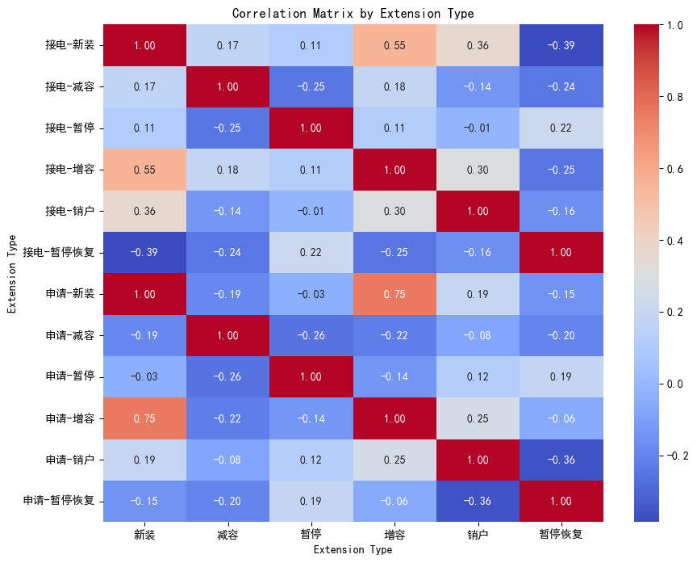

# 相关性分析

## 报装业务结构关系矩阵构建

### 整体关系分析：

行业层面上，对6种业扩业务数据两两之间做相关性分析，得到每个行业下的6*6的相关性热图，表示该行业下各个业扩数据两两之间的相关性关系；

全社会用电总计

企业层面上，同样得到6*6的相关性热图，然后将企业与其对应行业作比较，得出企业与行业的一致性和特异性。

企业的业扩数据好像暂未整理

#### 企业与行业比较方法

可以理解成是矩阵的相似度计算、或者图像的相关性分析

### 2.  滑动窗口关系分析：
行业层面上，选定滑动窗口大小，对6种业扩业务数据建模，得到6*6随时间变化的相关性矩阵；
企业层面上，同样得到6*6随时间变化的相关性矩阵，然后作比较，得出企业与行业在不同时间段内的一致性和特异性。